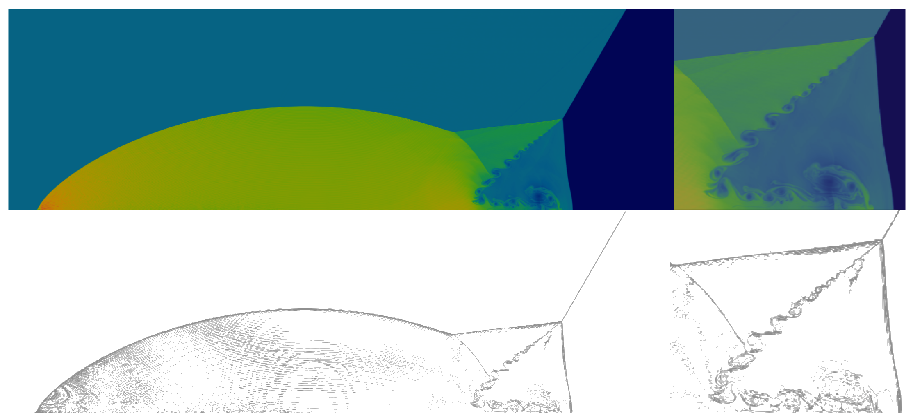
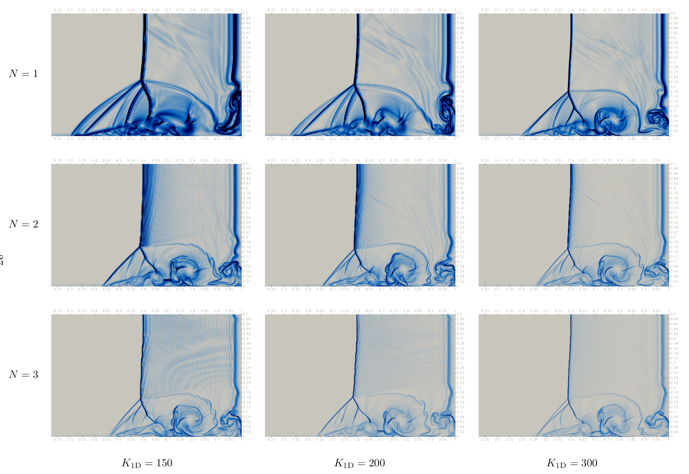
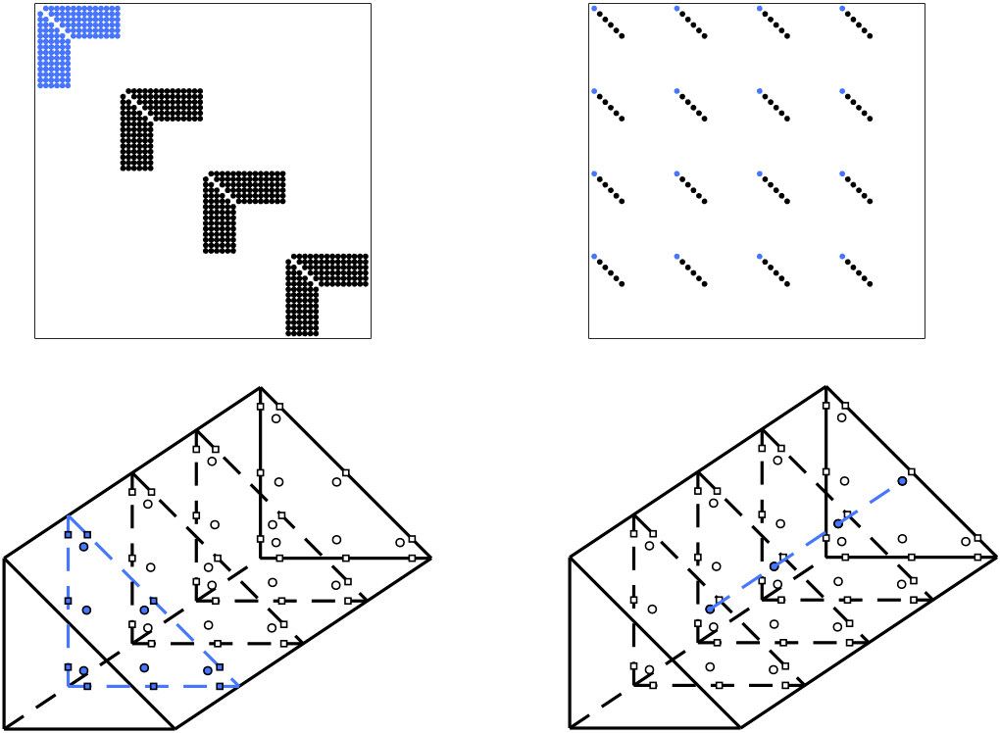

### A positivity preserving strategy for entropy stable discontinuous Galerkin discretizations

We developed a positivity limiting strategy for entropy stable discontinuous Galerkin discretizations of the compressible Euler and Navier-Stokes equations. The key ingredient in the limiting procedure is the low order positivity-preserving discretization based on **graph viscosity terms**. The proposed limiting strategy is both positivity preserving and discretely entropy stable for the compressible Euler and Navier-Stokes equations.

***Figure*** Density plot of the Double Mach Reflection test case for the compressible Euler equation. Polynomial degree 3, 218750 uniform quadrilateral elements. Only positivity limiting with shock capturing is applied to the ESDG discretization.    

***Figure*** Schlieren visualization of the Daru-Tenaud test case for the compressible Navier-Stokes equations. $Re = 1000$, only positivity limiting (without shock capturing) is applied to the ESDG discretization.    

### Entropy Stable Discontinuous Galerkin-Fourier methods

We developed a novel discontinuous Galerkin-Fourier method for systems of nonlinear conservation laws. It is suitable
for simulating flows with spanwise homogeneous geometries. The computational domain is discretized into wedges, and the
approximation space is the tensor product of polynomial basis and nodal Fourier basis. The construction
of such methods depends on the summation-by-parts (SBP) operators. In particular, we used the **hybridized SBP
operator**
introduced by Chan and the **spectral differentiation matrix**. The resulting formulation satisfies a discrete entropy
inequality. We accelerate the implementation using GPU, and we divide the computation into two passes, one through
triangles,
another through Fourier slices, to utilize the data locality.

***Figure***  Sparsity plot of the hybridized SBP operators and the spectral differentiation matrices. Highlighted nodes
correspond to flux evaluations in the physical space.  

